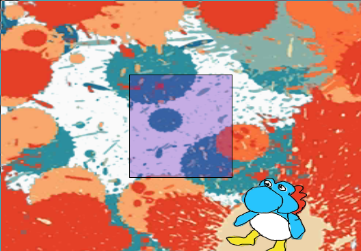

# tsp5-starter
a starter project for [p5js](https://p5js.org/) with [typescript](https://www.typescriptlang.org/)



## Setup
0. clone this repository
1. install typescript:
```npm install -g typescript```
2. install dependencies (not needed if you prefer your own webserver)
3. run typescript and http-server
```npm start``` or ```npm run watch``` to just run typescript
4. open http://localhost:8080 on your browser
5. edit files in src/ and reload browser to see changes

Note: Opening index.html directly in the browser may not work since some browsers disable fetching from the filesystem.

## Deploying
0. run: ```npm run dist``` (the files will be in dist/ directory)
1. copy or move dist/ to your webserver directory (such as C:\xampp\htdocs or /var/www/html)

## Documentation
[p5 reference](https://p5js.org/reference/)

[p5 examples](https://p5js.org/examples/)

Note: you must prefix p5 to all the functions and constants
found in the documentation. For instance, the code found
in the [example](https://p5js.org/examples/structure-width-and-height.html) will be written as:
```javascript
p5.setup = function() {
  p5.createCanvas(720, 400);
}

p5.draw = function() {
  p5.background(127);
  p5.noStroke();
  for (var i = 0; i < p5.height; i += 20) {
    p5.fill(129, 206, 15);
    p5.rect(0, i, p5.width, 10);
    p5.fill(255);
    p5.rect(i, 0, 10, p5.height);
  }
}
```
